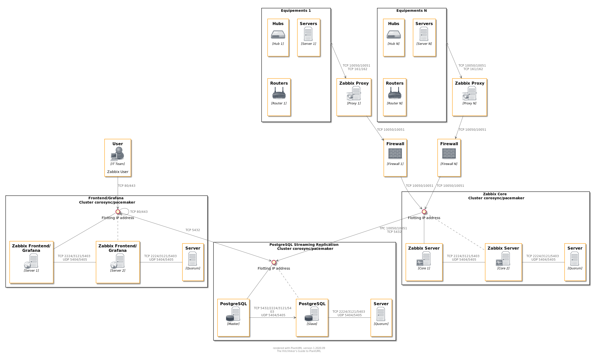

# Zabbix 5.0 HA with PostgreSQL 12 Streaming replication
Table of contents
- [Architecture](#architecture)
    - [Servers](#servers)
    - [Network](#network)
- [Schema](#schema)
- [Procedures](#procedures)
## Architecture
### Servers
        2 Zabbix Server with corosync/pacemaker cluster
        2 Zabbix Front with corosync/pacemaker cluster
        2 PostgreSQL 12 in Hot Standby
### Network
        Zabbix Server : 172.16.0.130 & 172.16.0.131 + VIP 172.16.0.136
        Zabbix Front  : 172.16.0.132 & 172.16.0.133 + VIP 172.16.0.137
        PostgreSQL    : 172.16.0.134 & 172.16.0.135 + VIP 172.16.0.138
## Schema

## Procedures
### [PostgreSQL](postgresql.md)
### [Zabbix Server](zabbix_server.md)
### [Zabbix Front](zabbix_front.md)
### [Grafana on Zabbix Front](grafana.md)
### [Zabbix Agent](zabbix_agent.md)

